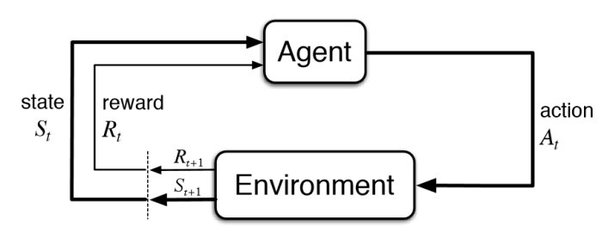

# Continual-Policy-Gradient

## About

Policy gradient methods are a family of algorithms in reinforcement learning that optimize and model the policy directly. This project implements incremental learning versions of policy gradient methods which allows the agent to learn while interacting with the environment simultaneously. This project (to the best of the author’s knowledge) is the first implementation of eligibility traces applied to deep neural networks in PyTorch.

## Batch vs. Continual Policy Gradient

Batch policy gradient essentially uses stochastic gradient descent to estimate the gradient. Therefore, larger batch sizes aka. larger batch rollouts would give better and more accurate results. This however is not scalable since large rollouts implies large data buffers to store encountered states, actions, and rewards.

Continual policy gradient method do not update the agent using stored batches. Instead, it can only use information for the current and next step to update the agent. Thus, the algorithm must update the agent only using information available at the current timestep.

## GAE and Eligibility Traces

Generalized Advantage Estimation (GAE) is a popular advantage estimate, often preferred, due to its ability to control bias and variance of the gradient estimate. Another benefit of GAE is that it can be reformulated to work with continual policy gradients. This is done by employing a trick known as eligibility traces which store a temporary record marking the occurrence of an event. For deep neural networks, we associate a trace for each weight in the network. At each step, we update the trace be decaying the existing trace and adding the gradient associated with the action.

Eligibility traces can be implemented in Pytorch by designing a custom optimizer for the actor and critic networks. We associated a trace for each weight in the network. Furthermore, special functions must be implement to set/reset the trace and also broadcasting the TD error across the networks.

## Results

The first figure compares the performance of batch and continual GAE. We can see that both approaches converge to the same solution. The second figure tests the algorithm on the same environment with different values of lambda.

## Note

A more detailed explanation (with math) can be found in the report above. 

